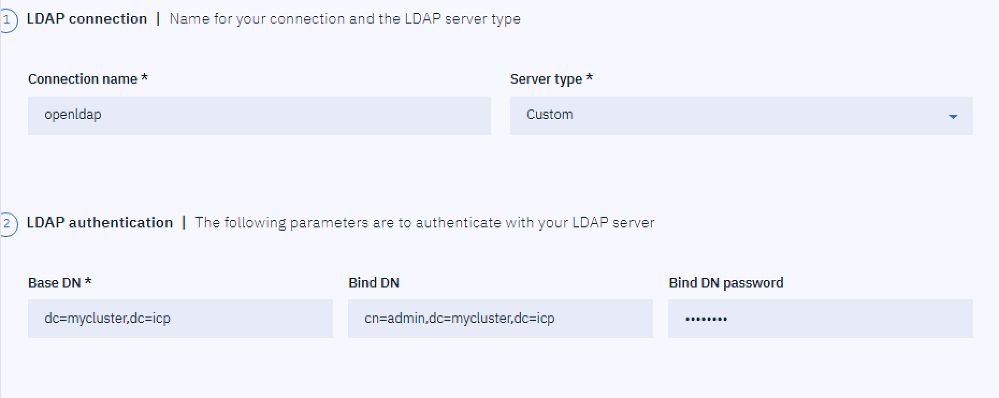
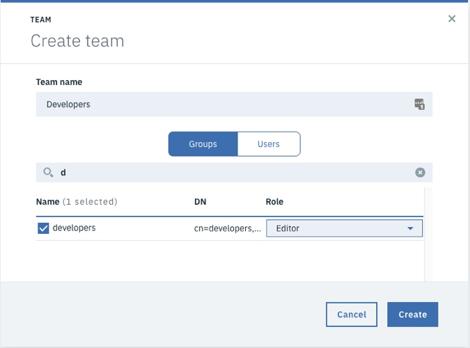
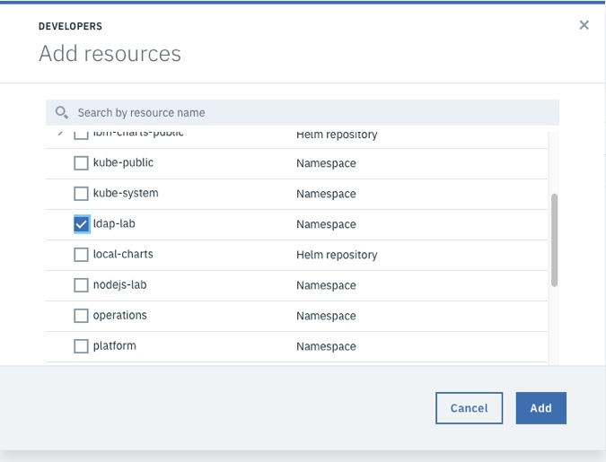
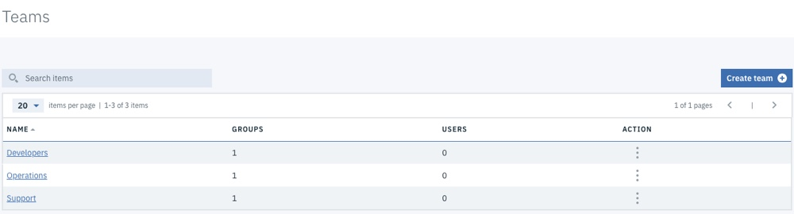
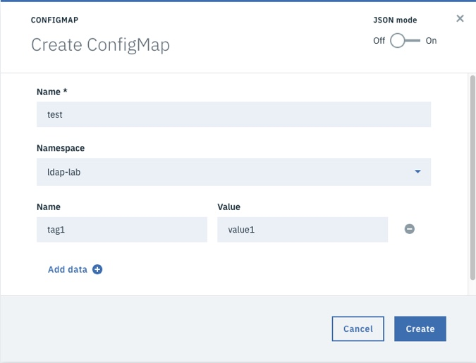

Lab - Configuring IBM Cloud Private to use OpenLDAP
---

### Table of contents

[1. Integrate IBM Cloud Private with OpenLDAP](#integrate)

## Overview
In this lab exercise, you configure IBM Cloud Private to use the OpenLDAP instance that is available in the environment.

<u>When the OpenLDAP server is running, the LDAP schema looks like this:</u>

> **<u>OU=Users</u>**
>
> 		​user1
>
> 		​user2
>
> 		​user3
>
> 		​user4
>
> 		​user5
>
> 		​user6
>
> 		
>
> **<u>OU=Groups</u>**
>
> 		​<u>group1</u>
>
> 				​user1
>
> 				​user2
>
> 		​<u>group2</u>
>
> 				​user3
>
> 				​user4
>
> 		​<u>group3</u>
>
> 				​user5
>
> 				​user6


*Note: The default password for all users except admin is: P@ssw0rd

*Note: This is not intented to be a production LDAP server, it is only being used as an example for integrating ICP with an LDAP server, and testing RBAC concepts.*

> **If you want to build your own OpenLDAP Docker image that is based on this image, you can find the source code here**: https://github.com/jdiggity22/openldap


### Integrate IBM Cloud Private with OpenLDAP <a name="integrate"></a>
In this section, you configure IBM Cloud Private to use the OpenLDAP server that you just deployed for Role Based Access Control (RBAC).

#### Create the LDAP Connection
1. If you are not already logged in to the ICP Admin Console from a previous exercise, open a browser and navigate to `https://<ICP_management_ingress>:8443`. Log in by using `username: admin` and `password: admin`.

2. Click **Menu**, and then select **Manage > Identity & Acces > Authentication**.

3. When the **No LDAP connection found** message displays, click **Create LDAP Connection**.

4. Enter the following details:

   #### LDAP Connection

   - Name: `OpenLDAP`

   - Type: `Custom`

   - URL: `ldap://<ip-of-ldap-service>:389`  

     **Note:** If not instructed otherwise use 10.10.99.30 as `<ip-of-ldap-service>`

   #### LDAP authentication

   - Base DN: `dc=mycluser,dc=icp`
   - Bind DN: `cn=admin,dc=mycluser,dc=icp`
   - Admin Password: `admin`

   

   #### LDAP Filters

   - Group filter: `(&(cn=%v)(objectclass=groupOfUniqueNames))`
   - User filter: `(&(uid=%v)(objectclass=inetOrgPerson))`
   - Group ID map: `*:cn`
   - User ID map: `*:uid`
   - Group member ID map: `groupOfUniqueNames:uniqueMember`

   

5. Click **Test Connection** to make sure your settings are valid. If so, you see a message stating that your connection is valid.

6. Click **Connect** to create the connection.

#### Create Namespaces
To prevent different groups from being able to view or modify each other's resources, you can create a level of isolation. To do this, create namespaces that you can associate with your teams.

1. Execute the following command to create an ICP namespace:

   ```
   kubectl create namespace <your namespace>
   ```

#### Create Teams
In the section, you work through the process of creating teams in ICP, and assign roles to them. These teams are based on the LDAP groups that are defined in your OpenLDAP container.

1. In the ICP Admin Console click **Manage -> Teams**.

2. Click **Create team**.

3. Enter the team name *developers*.

4. Select the `group1` group from the table below.

   **Note:** The LDAP groups do not show up in the table below until a filter is applied. To find the group, type "g" in the search field. The groups that start with "g" are populated in the table.

5. Grant the developers team ***Editor*** access.

  

6. Click **Create**.

7. Select the team that you created from the *Teams* list.

8. Navigate to the *Resources* tab.

9. Click **Add resources**.

10. From the list of namespaces, select *ldap-lab*.

  

11. Click **Add**.

  Repeat the process to create two more teams with the values below.

  | Team Name  | LDAP Group | Role     | Namespace   |
  | ---------- | ---------- | -------- | ----------  |
  | operations | group2     | operator | <namespace> |
  | support    | group3     | viewer   | <namespace  |

  When you are finished, you have three **Teams**.

    

#### Validate the Users
In this section, you explore the differences between the groups that you created. Follow the steps below to explore the differences between the roles assigned to the different groups.

1. Log out of the ICP Administration Console.

2. Log in as a member of the **developers** team that has **editor** rights, for example, `user1` with password: `P@ssw0rd`.

3. Check whether you can see any existing **Deployments**, **ConfigMaps** or other artifacts.  Note that the `<namespace>` namespace is empty, and `user1` can not see artifacts in other namespaces. Also, `user1` can not create anything.

4. Log out of the ICP Administration Console.

5. Log in as a member of the **support** team that has **viewer** rights, for example, `user5` with password: `P@ssw0rd`.

6. Check whether you can see any existing **Deployments**, **ConfigMaps** or other artifacts. Note that the `<namespace>` namespace is empty, and `user5` can not see artifacts in other namespaces. Also, `user5` can not create anything.

7. Log out of the ICP Administration Console.

8. Log in as a member of the **operations** team that has **operator** rights, for example, `user3` with password: `P@ssw0rd`.

9. Check whether you can see any existing **Deployments**, **ConfigMaps** or other artifacts. Note that the `<namespace>` namespace is empty, and `user3` can not see artifacts in other namespaces. Also note that `user3` has access to create Deployemnts and ConfigMaps.

10. Create a simple **ConfigMap** with one name/value pair, such as the one below.

  

11. Log out of the ICP Administration Console.

12. Log in as a member of the **developers** team that has **editor** rights, for example, `user1` with password: `P@ssw0rd`.

13. Can you see the **ConfigMap**? Can you change it?

14. Log out of the ICP Administration Console.

15. Log in as a member of the **support** team that has **viewer** rights, for example, `user5` with password: `P@ssw0rd`.

13. Can you see the **ConfigMap**? Can you change it?

14. Log out of the ICP Administration Console.

#### End of Lab Review
  In this lab exercise, you explored Role Based Access Control in IBM Cloud Private. You learned about:
  - Configuring IBM Cloud Private to connect to LDAP
  - Creating Teams and assigning Resources
  - The different types of access control that are available in IBM Cloud Private

## End of Lab Exercise
